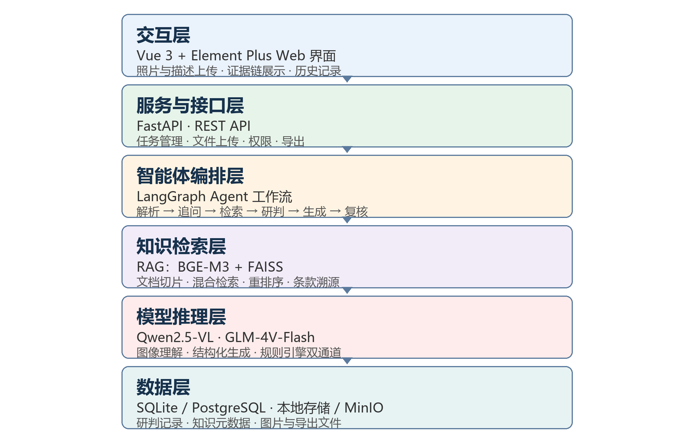

# 多模态基层安全隐患智能研判与处置辅助系统项目计划书

**大学生大模型创新大赛参赛项目 · 技术方案与实施路线**

编制日期：2026年9月

| 项目 | 内容 |
| --- | --- |
| 项目名称 | 多模态基层安全隐患智能研判与处置辅助系统 |
| 项目定位 | 面向基层巡查人员的人机协同隐患研判辅助工具 |
| 参赛方向 | 大学生大模型创新大赛应用创新方向 |
| 项目周期 | 8 周（2026 年 9 月至 11 月） |
| 团队规模 | 3 至 5 人 |
| 建议预算 | 0 至 500 元 |
| 核心交付物 | 可运行 Web Demo、评测集与评测报告、演示视频、PPT、源代码仓库 |

---

编写说明：本计划书面向参赛团队、指导老师和评审专家，说明项目要解决的问题、功能范围、技术选型、系统架构、知识库建设、评测方法、实施计划、成本与风险，并作为后续开发的统一技术约定。方案以学生团队在 8 周内可实际完成为目标，优先保证可演示、可评测、可复现。

# 一、项目概述

## 1.1 项目背景与问题

基层安全隐患排查由社区网格员、厂区安全员、林区巡查员等一线人员承担，普遍存在专业知识不足、规范记忆不全、现场处置无依据、上报材料繁琐等问题。消防安全、生产安全、社区治理、森林防火等领域的排查标准和处置流程分散在大量法规与标准文件中，一线人员很难在现场快速形成规范结论。

典型问题包括：

- 现场难以快速判断风险等级，处置依赖个人经验。
- 不清楚对应法律法规、判定标准和整改要求。
- 无法快速生成规范的整改建议与处置方案。
- 乡镇和林区普遍缺少现场专家支撑。
- 事后编写台账、工单、简报耗时长，格式不统一。

## 1.2 项目定位

本项目构建“拍照输入、智能研判、自动成文、证据溯源、人机复核”的基层安全隐患研判辅助系统。系统定位为人机协同辅助工具，不替代人工判断，最终结论由巡查人员和责任单位确认。

- 双模态输入：现场照片加文字描述组合研判，降低单纯视觉识别的误判风险。
- 知识库支撑：结论基于公开法规和标准片段，逐条展示来源与原文。
- Agent 闭环：解析、追问、检索、研判、生成、复核串联为可解释流程。
- 低门槛低成本：浏览器即可使用，无需专用硬件，模型调用以免费额度和低单价 API 为主。

## 1.3 项目原则

- MVP 优先：先打通消防与社区两类高频场景，再扩展生产安全和林区场景。
- 可评测：建立小型脱敏测试集与量化指标，每周回归，防止效果回退。
- 可复现：代码、知识库构建脚本、评测集和文档统一存放在项目仓库。
- 可演示：保留中间结果与证据链，评审可以点开查看研判依据。

# 二、竞赛目标与成果范围

## 2.1 参赛目标

在比赛周期内交付一个可以现场演示、可以量化评测、可以持续迭代的 MVP 系统，并用完整证据链和评测数据支撑答辩。

交付成果：

- 可运行的前后端系统，支持一次完整的多模态隐患研判。
- 30 至 50 条脱敏评测案例与评测报告。
- 3 至 5 分钟演示视频。
- 项目计划书、PPT、源代码仓库和部署说明。

## 2.2 MVP 范围

MVP 阶段纳入以下能力：

- 照片加文字双模态输入，支持多图。
- 多模态解析、信息不足时追问。
- 法规知识库检索与条款溯源。
- 风险分级、处置方案、工单、台账、简报生成。
- 历史记录、导出、管理员知识库管理。
- 置信度分级与人工确认。

MVP 不纳入以下能力，作为后续迭代方向：

- 移动端 App 或小程序。
- 整改照片回传与前后对比。
- 隐患地图、风险画像与趋势分析。
- 政务系统对接、内网部署与等保。
- 端侧离线大模型。

# 三、用户流程与功能设计

## 3.1 一次完整研判流程

1. 巡查员上传 1 至 3 张现场照片，并填写位置、现象、环境等文字描述。
2. 系统调用多模态模型解析照片，得到结构化隐患描述。
3. 信息不充分时，Agent 主动追问，最多两轮，例如破损程度、所处楼层、是否影响疏散通道。
4. RAG 检索相关法规和标准，返回条款原文与来源。
5. 规则引擎加 LLM 完成风险分级，输出隐患类别、等级、依据和置信度。
6. 证据检查通过后生成处置建议、整改工单、巡查台账和上报简报。
7. 巡查员确认或修改结果，系统定稿并保存历史记录。

## 3.2 功能清单

| 功能模块 | 说明 | 优先级 |
| --- | --- | --- |
| 多模态输入与解析 | 照片加文字输入，输出结构化描述 | P0 |
| 知识库检索与溯源 | 条款检索、原文展示、来源标注 | P0 |
| 风险分级与规则引擎 | 规则加模型双通道分级 | P0 |
| 处置方案生成 | 现场处置与整改建议 | P0 |
| 工单台账简报生成 | 可复制、可导出的标准文书 | P0 |
| 历史记录与导出 | 研判记录查询、批量导出 | P0 |
| 追问与信息补全 | 信息不足时主动提问 | P1 |
| 置信度与人工复核 | 低置信度强制人工确认 | P1 |
| 管理员知识库管理 | 上传、解析预览、审核发布 | P1 |
| 演示数据与示例 | 内置样例与一键演示 | P0 |
| 评测报告页面 | 在线查看指标与 badcase | P2 |

## 3.3 输入输出样例

以“住宅楼道堆放杂物”为例：

- 输入：3 张楼道照片，文字为“××小区 3 栋 2 单元楼道堆放纸箱杂物，通行明显受阻”。
- 系统追问：是否涉及疏散通道或安全出口？杂物持续多久？
- 输出：隐患类别为占用或堵塞疏散通道；风险等级为一级，应立即处置；依据包括消防相关法规和检索到的现行规范原文；建议包括立即清理疏散通道并采取临时安全措施；同时生成隐患研判单、整改工单和上报简报，每条结论附条款来源。

示例中的具体条款与等级以系统检索到的现行有效文本为准，计划书不预置未经核对的条文。

# 四、技术选型与依据

## 4.1 选型原则

- 学生团队在 8 周内能独立完成，学习曲线适中。
- 优先使用免费额度、开源组件和官方 API，避免 GPU 硬件门槛。
- 模型和存储组件接口化，后续可替换。
- 开发与演示环境要求低，普通笔记本即可运行。

## 4.2 技术栈总表

| 层级 | 技术选型 | 说明 |
| --- | --- | --- |
| 前端 | Vue 3、TypeScript、Vite、Element Plus | 中文生态好，组件完善，适合快速搭建管理型页面 |
| 状态与请求 | Pinia、Axios | 状态管理与统一 HTTP 调用 |
| 后端 | Python 3.11+、FastAPI、Uvicorn | 异步接口、Pydantic 校验、自带 Swagger 文档 |
| 数据访问 | SQLAlchemy 2、SQLite（MVP）、PostgreSQL（部署） | 开发简单，部署阶段可迁移 |
| 智能体框架 | LangGraph、LangChain Core | 工作流节点可观测、可回退，便于展示与评测 |
| 多模态模型 | Qwen2.5-VL（DashScope API 首选）、GLM-4V-Flash（免费备选） | 中文场景和图片理解稳定，统一 provider 可切换 |
| 文本推理 | Qwen-Plus 或 GLM-4-Flash | 结构化生成与 Agent 推理 |
| 文本嵌入 | BGE-M3（API 或本地）或 DashScope text-embedding-v3 | 中文法规检索效果好 |
| 向量库 | FAISS（MVP）、Qdrant 或 Milvus（规模化） | MVP 零运维，接口预留扩展 |
| 对象存储 | 本地磁盘（MVP）、MinIO（规模化） | 保存图片与导出文件 |
| 部署 | Docker Compose、Nginx | 本地与演示服务器行为一致 |
| 开发工具链 | Git、Gitee、VS Code、uv、pytest、Ruff、APIFox | 协作、质量与接口调试 |

## 4.3 多模态模型选型论证

| 方案 | 优点 | 风险 | 结论 |
| --- | --- | --- | --- |
| DeepSeek-VL 自建部署 | 权重开源、可控性强 | 需要 GPU，商业 API 不成熟，团队调试成本高 | 不作为首选 |
| Qwen2.5-VL API | 中文场景、OCR 与多图理解较强，有免费额度和低单价 | 依赖云 API 与额度 | 首选 |
| GLM-4V-Flash | 免费、接入简单、运行稳定 | 复杂场景能力弱于大参数模型 | 免费备选与降本通道 |
| 本地 Qwen2.5-VL 7B（Ollama） | 可离线演示 | 需要一定显存，效果有限 | 演示备选，不阻塞主线 |

## 4.4 关键技术决策

- 使用 LangGraph 搭建工作流：多轮追问、工具调用、失败回退和中间状态展示在比赛演示中价值高，评审可以直接看到 Agent 的研判过程。
- 风险分级不只用 LLM：先由结构化规则初步判定，再由 LLM 结合检索条款进行解释与校验，降低结果随机性。
- 先使用 FAISS，再按需迁移：MVP 阶段知识条数为数百至数千条，FAISS 零运维；数据量或并发上升后再迁移 Qdrant 或 Milvus。
- 以 API 为主、本地模型为辅：学生团队无 GPU 预算，API 免费额度足够完成开发和演示，同时保留 Ollama 本地通道作为演示备份。
- 防幻觉策略：生成结论必须引用检索片段，证据检查节点逐条校验依据；无依据的关键结论进入低置信分支并提示人工复核。

# 五、系统架构设计

## 5.1 总体架构



系统分为六层：交互层、服务与接口层、智能体编排层、知识检索层、模型推理层和数据层。交互层面向巡查员；FastAPI 提供统一接口并管理任务；LangGraph 编排研判流程；RAG 知识库提供条款溯源；模型层完成图像理解与文本生成；数据层保存研判记录、上传图片与导出文件。

## 5.2 数据流

1. 前端上传图片和文字，FastAPI 保存文件并创建研判记录。
2. LangGraph 调用视觉模型，得到结构化隐患描述。
3. 信息充分性检查决定继续或追问。
4. 按场景过滤并检索知识库，重排序得到 Top 5 条款。
5. 规则引擎与 LLM 联合完成风险分级。
6. 证据检查通过后生成处置方案和标准文书。
7. 结果保存历史记录，前端展示证据链。

## 5.3 项目目录结构

```text
MultiModel-Safety-Hazard-Agent/
    backend/
        app/
            api/        # FastAPI 路由
            core/       # 配置、安全、日志
            models/     # SQLAlchemy 模型
            schemas/    # Pydantic 输入输出
            services/   # vision、rag、agent、report
            main.py
        data/           # 知识文档、评测集
        tests/
        pyproject.toml
    frontend/
        src/            # Vue 3 页面与组件
        package.json
    scripts/            # 建库、评测、数据生成
    docs/               # 计划书、架构图、演示脚本
    docker-compose.yml
```

## 5.4 核心 API 设计

| 方法 | 路径 | 说明 |
| --- | --- | --- |
| POST | /api/v1/assessments | 上传照片与描述，创建研判任务 |
| GET | /api/v1/assessments/{id} | 查询研判结果与证据链 |
| POST | /api/v1/assessments/{id}/followup | 提交追问回答，继续研判 |
| POST | /api/v1/assessments/{id}/confirm | 人工确认或修改后定稿 |
| GET | /api/v1/assessments | 历史记录与筛选 |
| GET | /api/v1/assessments/{id}/export | 导出工单、台账、简报 |
| POST | /api/v1/knowledge/documents | 管理员上传规范文档 |
| GET | /api/v1/knowledge/documents/{id} | 查看解析预览 |
| POST | /api/v1/knowledge/documents/{id}/publish | 审核后发布入库 |
| GET | /api/v1/health | 健康检查 |

# 六、知识库建设方案

## 6.1 数据来源

- 国家法律法规与部门规章：安全生产、消防、森林防火等公开现行有效文本。
- 国家或行业标准：与隐患排查、判定和整改相关的现行标准文本。
- 重庆地方文件：地方法规、政府通告、应急管理部门公开文件。
- 自建演示样本：团队成员自行拍摄并可授权使用的图片与场景说明，不包含他人隐私信息。

入库前需要人工核对文号、版本和效力。引用结果展示来源名称、条款号、原文和采集日期，避免引用已废止条款。

## 6.2 知识库处理流程

1. 收集：优先从官方发布渠道获取 PDF、Word 或网页原文，保存来源链接。
2. 清洗：去除页眉页脚、水印和无效章节，保留标题层级与条文编号。
3. 切片：按章条与语义边界切片，每片 300 至 500 字，重叠 50 字，记录来源、文号、条款号、版本和采集日期。
4. 向量化：使用 BGE-M3 生成文本向量，同时保留关键词用于 BM25 检索。
5. 入库：FAISS 建立向量索引，SQLite 保存元数据，支持按场景和行政区过滤。
6. 质检：人工抽检三成切片，确认内容正确、可检索、元数据完整。

## 6.3 检索策略

- 混合检索：BM25 关键词检索与向量相似度检索并行，合并取 Top 20。
- 重排序：使用 bge-reranker 或 LLM 精读，取 Top 5 作为最终依据。
- 场景过滤：先按消防、生产、社区、林区标签过滤，再执行检索。
- 条款补全：命中条文时返回整条原文，避免截断关键句导致误读。

## 6.4 更新与版本管理

- 管理员上传新文档后进入待解析、待审核状态，审核通过后才能发布。
- 每个文档保留版本记录；法规更新后旧版本标记为失效，新结论只引用有效版本。
- 定期核对采集日期与发布状态，必要时标记失效并补充新版本。

# 七、Agent 与研判设计

## 7.1 Agent 工作流节点

| 节点 | 输入 | 输出 | 异常与回退 |
| --- | --- | --- | --- |
| 输入解析 | 图片与文字 | 结构化隐患描述 | 解析失败自动重试一次 |
| 充分性检查 | 结构化描述 | 通过或追问问题清单 | 信息不足时追问，最多两轮 |
| 知识检索 | 补充后的描述 | Top 5 条款片段与元数据 | 无结果时降低置信度并提示补充 |
| 风险研判 | 条款与规则库 | 隐患类别、等级、依据、置信度 | 规则与模型不一致时取低置信度 |
| 证据检查 | 生成草案 | 校验依据是否来自检索片段 | 无依据结论剔除或转人工复核 |
| 方案生成 | 结论与条款 | 处置建议、工单、台账、简报 | 必填字段缺失时自动补齐 |
| 人工复核 | 全链路结果 | 确认发布或修改后定稿 | 低置信度时必须人工确认 |

## 7.2 风险分级设计

系统采用法定分类与操作分级双视角。法定分类以现行法规中的一般事故隐患和重大事故隐患为基础；操作分级用于界面统一和处置时限提示。

| 操作等级 | 含义 | 处置时限 | 对应法定概念 |
| --- | --- | --- | --- |
| 一级，紧急 | 可能造成人员伤害或重大财产损失，需立即处置 | 立即处置并同步上报 | 一般对应重大事故隐患或紧急情形 |
| 二级，限期整改 | 明显违反规范但短时风险可控 | 规定期限内完成整改 | 一般对应一般事故隐患中的较重情形 |
| 三级，建议改进 | 管理性或轻微问题 | 列入计划整改 | 一般事故隐患中的轻微情形 |

具体判定以检索到的现行法规和判定标准为准，映射仅用于界面统一。

## 7.3 置信度与人工复核

置信度由视觉理解、检索相关性、规则命中、模型自评四个维度加权得到：conf 等于各维度得分乘以权重之和，初值权重为 0.3、0.3、0.2、0.2，可在配置中调整。

- 置信度不低于 0.8：自动生成结果，提示用户确认。
- 置信度 0.5 至 0.8：标记建议人工复核。
- 置信度低于 0.5：主动追问并补充信息，不直接输出结论。

## 7.4 防幻觉与证据链

- 输出只允许引用检索片段原文，无检索支持的处置建议降级为通用安全提示。
- 每条结论包含来源文档、文号、条款号、原文片段和检索时间。
- 界面提供证据链标签页，评审和用户可以展开查看每条依据。

# 八、评测方案

## 8.1 脱敏测试集

构建 30 至 50 条真实感的脱敏案例，覆盖消防、社区、生产、林区四类场景。每个案例包含照片、文字描述和标准答案；标准答案记录隐患类别、风险等级、应引用条款和处置建议要点，由指导老师或安全专业人员标注。

## 8.2 评测指标

| 指标 | 定义 | 目标值 |
| --- | --- | --- |
| 隐患类别准确率 | 系统输出的隐患类别与标注一致 | 不低于 80% |
| 风险等级一致率 | 系统等级与标注一致 | 不低于 85% |
| 条款命中率 | 标准条款出现在 Top 5 检索结果中 | 不低于 85% |
| 溯源准确率 | 人工抽检结论具有有效依据的比例 | 不低于 90% |
| 幻觉率 | 无依据关键结论占比 | 不高于 5% |
| 工单字段完整率 | 必填字段齐全的比例 | 不低于 95% |
| 端到端耗时 | 上传到结果返回的时间 | 不超过 30 秒 |
| 追问有效率 | 追问后信息确实得到补充的比例 | 不低于 70% |

## 8.3 评测流程

- 每周运行一次离线回归，任一核心指标回退时禁止合入演示分支。
- 人工抽检为主，LLM-as-judge 仅作辅助，最终以专家标注为准。
- 记录 badcase 并形成评测与优化记录，作为答辩材料。

# 九、非功能需求与合规

## 9.1 性能与可靠性

- 单次研判端到端耗时不超过 30 秒，单张图片不超过 10MB，单次支持 1 至 3 张。
- 服务重启不丢失历史记录，上传失败可重试。

## 9.2 安全与隐私

- 上传图片默认检查人脸、车牌等敏感信息，提示或在入库前打码。
- 巡查员只能查看本人记录，管理员管理知识库与系统配置。
- 记录上传、研判、确认、导出等关键操作日志。
- 图片保存在本地加密目录或 MinIO 私有桶，数据库按最小权限访问。

## 9.3 合规边界

- 系统仅提供辅助研判参考，不替代执法、处罚和专家意见。
- 页面明确标注 AI 辅助生成、需人工确认；高风险结论必须人工确认后导出。
- 政务生产环境需要内网部署、等保测评和数据不出域，不在竞赛 MVP 范围内。

# 十、实施计划

## 10.1 八周开发计划

| 周次 | 阶段 | 关键任务 | 验收标准 |
| --- | --- | --- | --- |
| 第 1 周 | 技术预研 | 注册 API、跑通视觉模型、LangGraph 示例、FAISS 检索示例 | 两张样例照片返回结构化描述 |
| 第 2 周 | 知识库 v0 | 收集消防与社区文档，清洗并切片入库 | 5 个典型问答可溯源 |
| 第 3 周 | 后端骨架 | FastAPI、文件上传、数据库、历史记录 | Swagger 可完成一次研判落库 |
| 第 4 周 | 研判链路 v1 | 多模态解析、RAG、分级、工单生成 | 5 个评测样例通过率不低于 70% |
| 第 5 周 | Agent 全流程 | 追问、置信度、证据检查、人工复核 | 评测指标达到目标的八成 |
| 第 6 周 | 前端 v1 | 上传、结果、历史、证据链页面 | 浏览器端到端跑通 |
| 第 7 周 | 评测优化 | 30 至 50 案例评测、badcase 修复 | 核心指标达标 |
| 第 8 周 | 成果包装 | 演示视频、PPT、计划书终稿、部署与答辩演练 | 全部交付物可现场演示 |

## 10.2 团队分工

| 角色 | 人数 | 职责 |
| --- | --- | --- |
| 项目负责人与产品 | 1 | 需求、进度、答辩主线 |
| 后端与 Agent | 1 至 2 | FastAPI、LangGraph、模型接入、评测脚本 |
| 知识库与数据 | 1 | 文档收集清洗、切片建库、测试集标注 |
| 前端 | 1 | Vue 页面、交互、演示优化 |
| 测试与文档 | 1，可兼任 | 评测回归、计划书、视频、PPT |

具体人数按实际团队调整：5 人最完整，3 人可运行，项目负责人兼任文档。

## 10.3 协作约定

- Git 分支管理：main 只接收通过测试的合并，功能开发使用 feature 分支。
- 每周运行一次评测回归，结果记录到评测报告。
- 关键技术决策写入文档并同步给全员。
- 首日任务为注册阿里云百炼与智谱账号、确认 API Key、初始化仓库、安装 Python 3.11 和 Node.js 环境。

# 十一、成本与资源

## 11.1 成本估算

| 项目 | 用途 | 费用估算 |
| --- | --- | --- |
| 视觉与文本 API | 开发与评测调用 | 免费额度为主，预计 0 至 200 元 |
| Embedding API | 建库与检索 | 免费额度内，预计 0 至 50 元 |
| 云服务器，可选 | 在线演示 | 学生优惠轻量服务器，约 50 至 150 元 |
| 软件与框架 | 全链路开发 | 开源免费 |
| 其他 | 拍摄素材与存储 | 0 至 50 元 |

预计总预算 0 至 500 元，本地开发演示可低至 0 元。

## 11.2 设备要求

- 开发机：Windows、macOS 或 Linux，16GB 内存，20GB 可用磁盘，无 GPU 也可完成。
- 演示环境：Chrome 或 Edge 浏览器，可选用云服务器提供在线访问。
- 本地小模型为可选能力：建议 8GB 显存以上 NVIDIA GPU，但不阻塞主线开发。

# 十二、风险与对策

| 风险 | 影响 | 对策 |
| --- | --- | --- |
| API 免费额度不足 | 开发与评测中断 | 多模型 provider 抽象、GLM 免费接口备选、控制评测成本、缓存图片结果 |
| 视觉识别误判 | 结论不可靠 | 文字双模态、追问、低置信转人工、评测集回归 |
| 法规条款过期 | 引用失效 | 记录版本与采集日期、人工审核发布、检索时过滤失效版本 |
| 法律术语误用 | 专业性质疑 | 采用法定分类、引用原文、页面标注辅助定位 |
| 图片隐私合规 | 数据风险 | 仅使用授权素材、入库前脱敏、最小化存储 |
| 演示网络异常 | 展示失败 | 本地部署、演示视频备份、离线样例缓存 |
| 时间不足 | 交付延期 | 严格 MVP 裁剪，先单场景跑通再扩展，第 4 周后冻结需求 |
| 答辩被质疑 | 影响评审结果 | 完整证据链、评测数据、badcase 复盘、现场演示接口返回 |

# 十三、创新点与竞争优势

## 13.1 创新点

- 人机协同双模态研判：照片、文字与追问组合，比纯视觉识别更贴近真实巡检流程。
- 证据链式防幻觉输出：每条结论可以展开来源与原文，评审可以直接验证。
- 规则与 LLM 双通道风险分级：降低随机性，分级依据可解释。
- Agent 全流程闭环：从现场拍照到工单成文一条链路，演示价值高。
- 低成本可复现：全开源、API 免费额度、8 周可完成，适合学生团队实际落地。

## 13.2 与同类产品差异

市面已有 AI 拍照识别隐患类工具，多为单一场景或纯视觉标签。本项目面向多行业基层场景，把识别、检索、分级、成文、人机复核组织为一个可解释闭环，并沉淀评测集与知识库，体现系统完整性和可落地性。

# 十四、预期成果与后续展望

## 14.1 预期成果

- MVP 系统：可运行 Web 应用、API 和知识库。
- 评测资产：30 至 50 条脱敏案例与评测报告。
- 展示材料：项目计划书、PPT、演示视频和项目仓库。

## 14.2 后续展望

- 引入整改照片回传与前后对比，形成发现、研判、整改、复核、销号闭环。
- 增加社区与园区风险画像、隐患热点地图，衔接城市治理平台。
- 在试点单位开展真实场景试用，根据反馈持续优化评测集与规则库。
- 探索政务内网部署、知识图谱和规范版本自动监测。

# 附录：首日行动清单

- 完成团队组队与分工。
- 注册阿里云百炼、智谱 BigModel、硅基流动账号并确认免费额度。
- 核对竞赛规则、提交材料和截止时间。
- 初始化 Git 仓库与项目目录。
- 安装 Python 3.11、Node.js 18 以上版本和 VS Code。
- 用 3 至 5 张示例图片跑通 Qwen2.5-VL 基础接口。
- 跑通 LangGraph 示例工作流和 FAISS 检索示例。
- 收集第一批消防与社区规范文档，保存原文与来源链接。

注：本计划书中的技术选型将随开发实践更新，表格中的法规分类与条款以现行有效文本为准。文档版本：2026 年 9 月。
